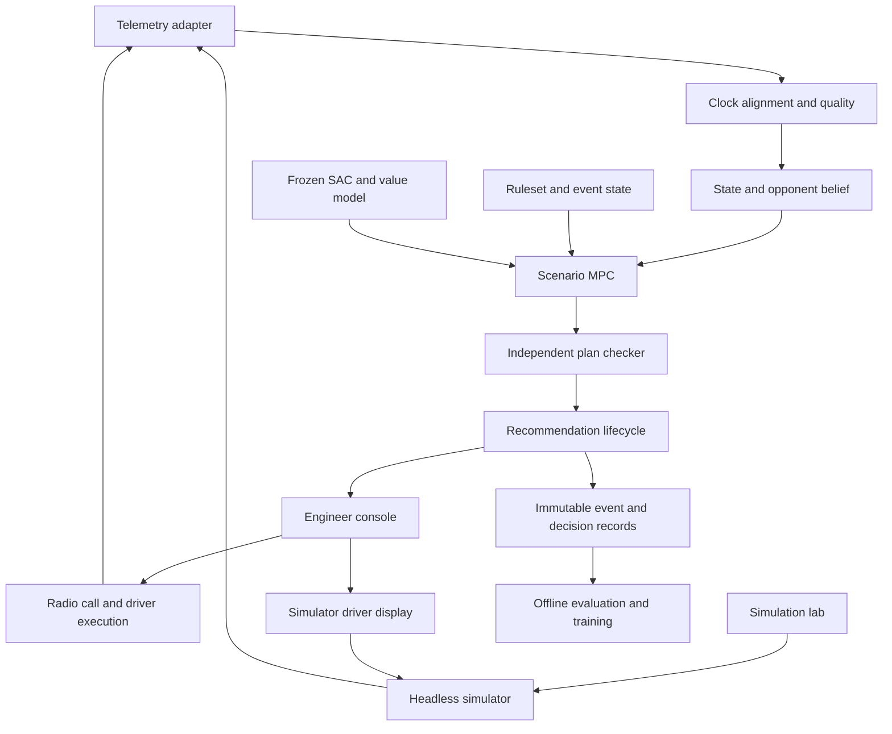

# Architecture

## Product boundary

AFTERLAP is an engineer decision-support product for electrical energy and racing battles. It optimises the near-term action while valuing consequences beyond the next overtake. The lab provides controlled training/evaluation; public telemetry provides reference observations; future authorised team telemetry provides richer own-car state. A connected steering display is confined to simulation. Actual F1 actuation and onboard electronics integration are excluded.

## Runtime flow



## Processes and ownership

Use a modular monolith, a session-runtime worker and separate batch workers. Next.js is the public HTTP control plane. Python work is invoked through `python -m afterlap_api.cli`. Python domain modules contain no HTTP dependency. The runtime owns an in-memory session state and serialises state mutations. IPC carries typed messages; the database is not polled on every physics tick. Batch simulation/training cannot consume the runtime's reserved CPU cores or overwrite its loaded artefacts.

React/TypeScript renders all web surfaces. Charts consume downsampled views with source timestamps. PostgreSQL stores sessions, decisions, operator events and manifests; partitioned Parquet stores high-volume telemetry and experiment trajectories; DuckDB is used for offline interrogation. CasADi formulates smooth dynamics; acados solves continuous subproblems; a bounded tactical enumerator handles discrete intentions and legal profiles. SAC and a separate ordinary-return value estimator are trained in PyTorch.

## One session lifecycle

1. Create session from immutable track/car/ruleset/model manifests. Validate required parameters and deployment mode.
2. Start adapter; record source capability declaration and observation provenance.
3. Build coherent state estimates using observations no later than the decision cutoff.
4. Generate legal tactical candidates, scenario rollouts and feasible energy schedules.
5. Recheck plan against the current ruleset, eligibility, freshness and execution delay.
6. Publish a versioned recommendation; engineer may select/reject. Selection is not execution.
7. Observe driver action, reconcile the expected versus actual state and invalidate obsolete plans.
8. Store outcome records at named checkpoints and at the evaluation horizon.
9. Stop cleanly; flush logs and manifest hashes. Replay never mutates the archived original.

## Trust and time boundaries

The simulator has a complete WorldState; the controller has only StateEstimate. Operational UIs receive StateEstimate and Recommendation, never a WorldState payload. Debug truth is a separate authenticated endpoint unavailable in replay/live-team modes. An event sequence orders session mutations; UTC is for human provenance, monotonic/session time is for numerical integration and expiry.

Ruleset changes invalidate outstanding plans. Model versions are pinned during a session. One operator owns the session control lease. A second operator can observe but cannot race the first through contradictory commands. Invalid/stale advice is withdrawn; continuation of an agreed baseline requires its validity to be re-established.

## Budgets (targets, not measured claims)

Start with 100 Hz simulated dynamics; perform convergence tests at 50/100/200 Hz. Estimate at up to 20 Hz when sources support it. Tactical planning is event-triggered and at approximately 1 Hz; initial p95 planner target is 200 ms on declared hardware. UI snapshots target 10 Hz with human advice stable over meaningful segments. Record ingestion-to-display age and human execution delay separately. Public 3.7 Hz channels must never be advertised as 20 Hz measurements.

## Runtime degradation

Missing required own-car energy -> analysis-only mode, no precise energy directive. Unknown opponent energy -> wider scenarios, not a made-up point value. Missing event rules -> unsupported eligibility/curve state. Solver timeout -> revalidated prior plan or withdrawn tactical advice. Database failure -> bounded local spool and visible persistence warning. Spool full -> halt new operational recommendations to preserve auditability. Training/model mismatch -> disable learned contribution and explicitly identify the validated baseline path.

## Future code layout

```text
implementation/
  apps/api/                 # backend routes and dependencies
  apps/web/                 # React routes and UI components
  packages/contracts/      # schemas and generated clients
  packages/core/           # data, simulation, rules, estimation, planning, learning
  workers/                 # session and batch process entrypoints
  configs/                 # tracks, cars, event packs, benchmark manifests
  tests/                   # contract and cross-module acceptance
  infra/                   # compose, health checks, local packaging
  handoffs/                # agent outputs and contract proposals
```

The directories above are a specification, not existing production code.


## Implementation refinements

The [selected stack](TECH_STACK.md) defines canonical packages, dependencies and deployment. The [learning implementation guide](../learning/README.md) fixes actor cadence at one second and uses the separate ordinary-return ensemble to rerank feasible finalists outside acados. Safety invalidation remains event-driven.
