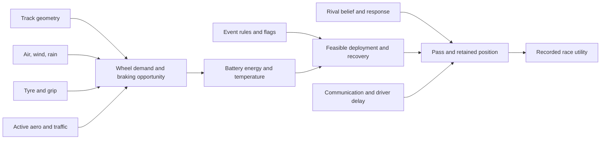

# Factor importance, reward weights and explainability

The phrase “every factor has a weight” mixes three different concepts. The product must keep them separate.

## Three meanings

1. **Physics parameters** have units and affect state transitions, such as drag coefficient, grip or battery efficiency. Estimate/calibrate them; never let RL reinterpret their units.
2. **Reward coefficients** state product priorities, such as elapsed time, finishing position and instruction churn. Humans set and freeze them before final evaluation.
3. **Policy feature influence** emerges from learned nonlinear interactions. A neural policy does not provide one stable meaningful weight per input. Scaling, correlation and operating state change apparent influence.

Rules and physical limits are hard constraints. Giving a violation a large penalty does not prove the policy will never violate it. The checker filters executable plans in training and serving.

## Causal factor graph

The policy observes estimates from this graph and proposes a budget. It cannot causally change weather, track or a rival's hidden battery. The simulator supplies the action-dependent response.

## Influence analysis

Use controlled interventions, not a decorative feature-importance bar chart:

- One-factor paired intervention: replay the same complete snapshot and RNG tape, changing one factor within physical support. Measure action delta and outcome delta.
- Group ablation: mask one permitted factor group and retrain/evaluate under the same budget. This measures dependence plus adaptation, not intrinsic truth.
- Policy occlusion: at inference, replace one group with its training reference distribution and measure output change. Correlated features make interpretation conditional.
- Global sensitivity: Sobol or Morris analysis on selected physical parameters through the simulator/controller. Report parameter ranges and interactions.
- Local gradient/integrated gradients: diagnostic of actor output near one state. Standardized-space gradients are not seconds or causal effects.
- Counterfactual regret: compare chosen action to feasible alternatives from the same snapshot with responsive rivals.

Every explanation names track, state, source, action, baseline and uncertainty. Avoid “weather was 18% important” without a precise metric and experiment.

## Factor registry

Create `configs/factors/factor-registry.yaml`. Each factor has ID, meaning, units, simulator role, observation source, missing behavior, supported range, distribution family, correlation group, causal parents, source and validation owner. Reward terms additionally have objective revision and coefficient rationale.

The registry feeds scenario generation, feature encoding and evidence reports. It does not automatically put every variable into the policy. Include a factor only when it is observable at decision time, changes action value, and can be supported/calibrated. More features can worsen sample efficiency and create leakage.

## Initial evidence questions

- Does wind direction change the preferred deployment point on a long straight after rotating through track heading?
- Does lower grip reduce recoverable energy and move the optimal attack later?
- Does a wider rival-energy belief increase reserve and poor-tail protection?
- Does high altitude change drag/downforce/cooling consistently rather than through an arbitrary track label?
- Does the actor remain stable when an irrelevant field changes?
- Does removing track lookahead materially hurt transfer to held-out geometry?

These are experiments. Do not prefill results. The presentation can explain the method while leaving measured outcomes unavailable until the benchmark runs.
